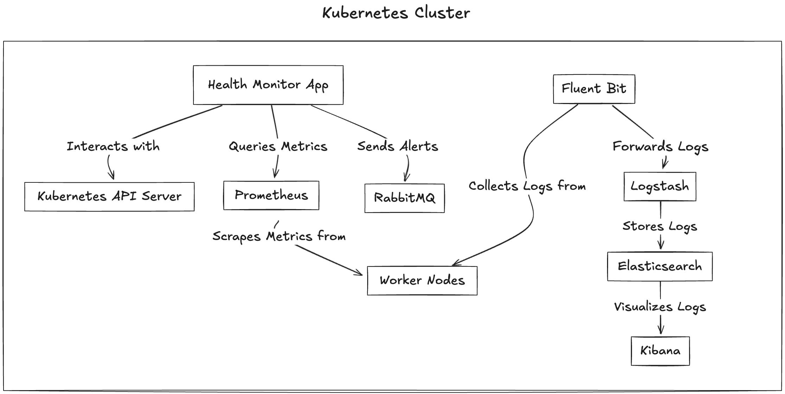

# Health Monitor Project

## Overview

This project is a Kubernetes-native application written in Go, designed to monitor the health of nodes and pods within a Kubernetes cluster. 
It integrates with Prometheus to collect metrics, uses RabbitMQ for alerting, and uses Elasticsearch, Kibana, Logstash, and Fluent Bit for log aggregation and visualization. 

## Tech Stack

- **Go**: Programming language used for the application.
- **Kubernetes**: Orchestrates deployment and management.
- **Prometheus**: Collects and queries resource metrics.
- **RabbitMQ**: Queues and dispatches alerts.
- **Elasticsearch, Kibana, Logstash (ELK Stack)**: Aggregates and visualizes logs.
- **Fluent Bit**: Forwards logs to Logstash.
- **Helm**: Manages deployment of services.
- **Docker**: Containerizes the application.
- **Minikube**: Provides a local Kubernetes cluster for development.

## Architecture



The application consists of the following components:

1. **Node Reconciler**: Monitors node CPU and memory usage via Prometheus and sends alerts to RabbitMQ when thresholds are exceeded.

2. **Pod Reconciler**: Monitors pod lifecycle events, restarts failing pods up to a retry limit, and sends alerts if necessary.

3. **RabbitMQ Integration**: Receives alerts from the reconcilers for processing and notification.

4. **ELK Stack Integration**: Collects and visualizes logs from the application and cluster.

## Deployment

### Prerequisites

- Kubernetes cluster (using Minikube or similar)
- Helm installed

### Steps

1. **Install RabbitMQ**:

   ```bash
   helm install rabbitmq oci://registry-1.docker.io/bitnamicharts/rabbitmq --namespace monitoring
   ```

   Access RabbitMQ:

   ```bash
   kubectl port-forward --namespace monitoring svc/rabbitmq 5672:5672
   kubectl port-forward --namespace monitoring svc/rabbitmq 15672:15672
   ```

2. **Install Prometheus**:

   ```bash
   helm install prometheus prometheus-community/prometheus --namespace monitoring
   ```

3. **Install ELK Stack**:

   - **Elasticsearch**:

     ```bash
     helm install elasticsearch elastic/elasticsearch --namespace monitoring
     ```

     Access Elasticsearch:

     ```bash
     kubectl port-forward --namespace monitoring svc/elasticsearch-master 9200:9200
     ```

   - **Kibana**:

     ```bash
     helm install kibana elastic/kibana --namespace monitoring
     ```

     Access Kibana:

     ```bash
     kubectl port-forward --namespace monitoring svc/kibana-kibana 5601:5601
     ```

   - **Logstash**:

     ```bash
     helm install logstash elastic/logstash --namespace monitoring
     ```

4. **Install Fluent Bit**:

   ```bash
   helm install fluentbit fluent/fluent-bit --namespace monitoring -f fluentbit-values.yaml
   ```

   Sample `fluentbit-values.yaml`:

   ```yaml
   output:
     logstash:
       host: logstash.monitoring.svc.cluster.local
       port: 5044
   ```

5. **Build and Deploy the Application**:

   - **Build Docker Image**:

     ```bash
     docker build -t health-monitor:latest .
     ```

   - **Load Image into Minikube**:

     ```bash
     minikube image load health-monitor:latest
     ```

   - **Deploy to Kubernetes**:

     Apply the `deployment.yaml` manifest:

     ```yaml
     apiVersion: apps/v1
     kind: Deployment
     metadata:
       name: health-monitor
     spec:
       replicas: 1
       selector:
         matchLabels:
           app: health-monitor
       template:
         metadata:
           labels:
             app: health-monitor
         spec:
           serviceAccountName: health-monitor-sa
           containers:
             - name: health-monitor
               image: health-monitor:latest
               imagePullPolicy: IfNotPresent
     ```

     Apply the deployment:

     ```bash
     kubectl apply -f deployment.yaml
     ```

6. **Configure RBAC**:

   Create and apply the `rbac.yaml` manifest:

   ```yaml
   apiVersion: v1
   kind: ServiceAccount
   metadata:
     name: health-monitor-sa

   ---

   apiVersion: rbac.authorization.k8s.io/v1
   kind: ClusterRole
   metadata:
     name: health-monitor-role
   rules:
     - apiGroups: [""]
       resources: ["pods", "nodes"]
       verbs: ["get", "list", "watch", "delete", "update"]

   ---

   apiVersion: rbac.authorization.k8s.io/v1
   kind: ClusterRoleBinding
   metadata:
     name: health-monitor-rolebinding
   subjects:
     - kind: ServiceAccount
       name: health-monitor-sa
       namespace: default
   roleRef:
     kind: ClusterRole
     name: health-monitor-role
     apiGroup: rbac.authorization.k8s.io
   ```

   Apply the RBAC configuration:

   ```bash
   kubectl apply -f rbac.yaml
   ```

## Configuration

The application uses Viper to manage configurations.

- **`config.json`**:

  ```json
  {
    "prometheus": {
      "host": "http://prometheus-service.default.svc.cluster.local",
      "port": "9090"
    },
    "rabbitMq": {
      "host": "rabbitmq.monitoring.svc.cluster.local",
      "port": "5672"
    }
  }
  ```

- **`secret.json`**:

  ```json
  {
    "rabbitMqCredentials": {
      "user": "user",
      "password": "your_password"
    }
  }
  ```
